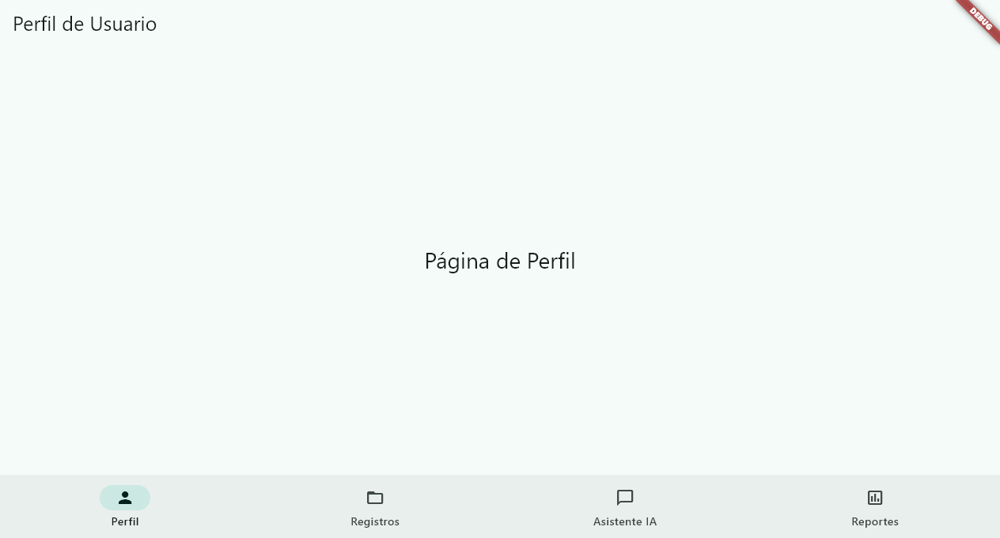
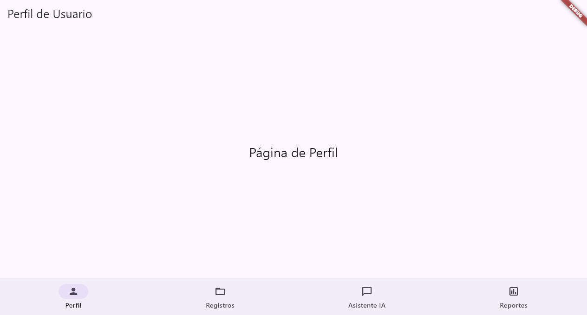
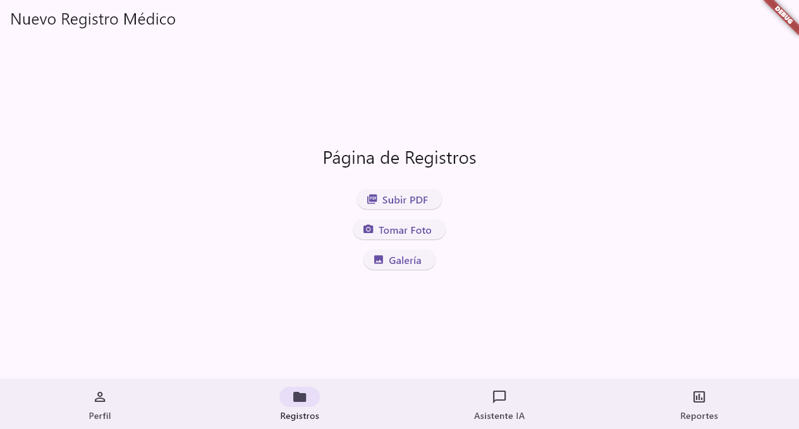
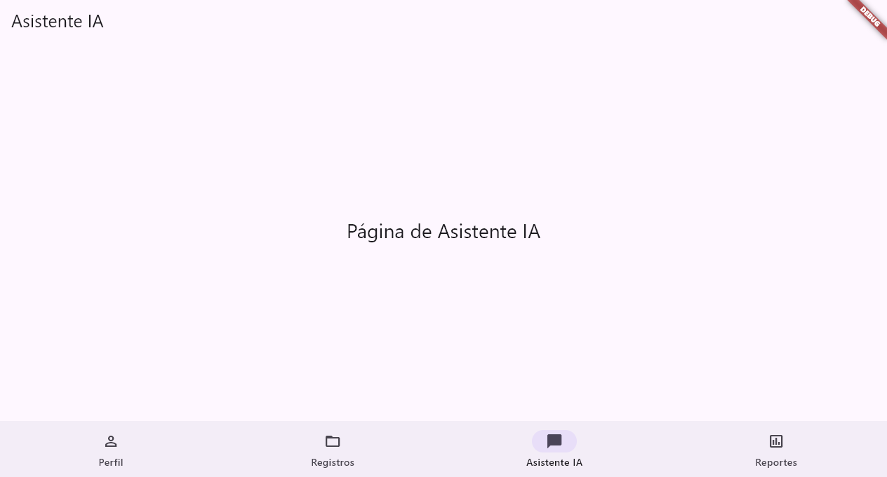
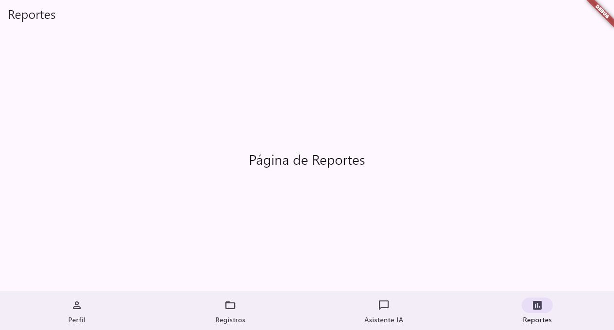
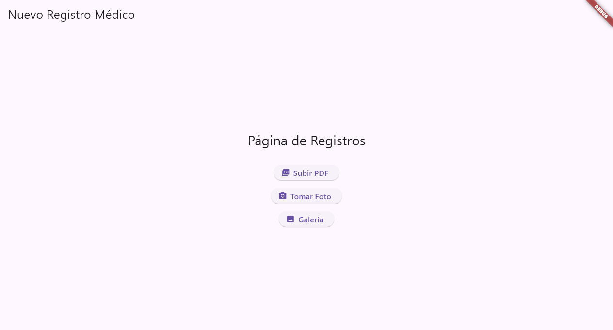
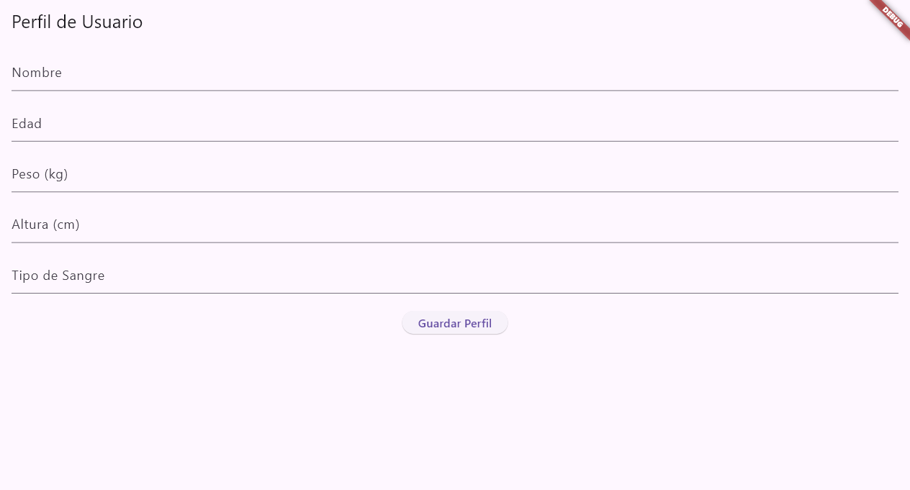
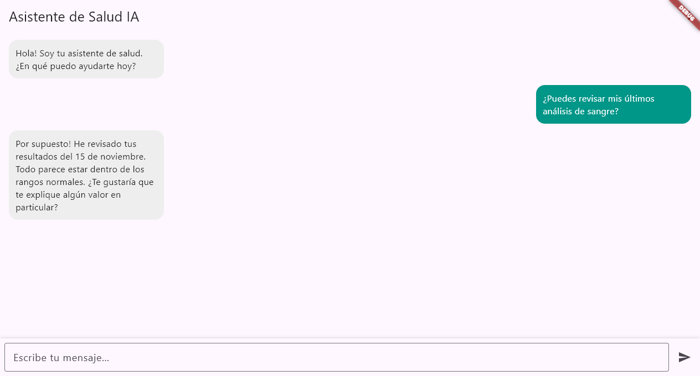

# OrionHealth 🏥

**Your Personal Health Data Sanctuary for the Future of Personalized Medicine**

[](https://www.gnu.org/licenses/agpl-3.0)
[](https://flutter.dev)
[](https://github.com/iberi22/OrionHealth/actions/workflows/android_build.yml)
[](https://github.com/iberi22/OrionHealth/issues)
[](https://github.com/iberi22/OrionHealth/commits/main)
[](https://github.com/iberi22/OrionHealth)

---

## 📊 Project Status

**0.8.0-beta — Flutter analyze: 0 issues • 41/41 tests passing • BLE medical sharing • Real ML Kit OCR • Drug Interaction Checker • Risk Calculator (ASCVD+QDiabetes+HTN) • GemmaLlmService with streaming • VectorStore HiRAG re-ranking • ReportGenerationService with Gemma/Gemini**

---

## 🌟 Vision

**OrionHealth** is a privacy-first, local-first health assistant that enables individuals to own and control their complete health data history. Built with Flutter and powered by on-device AI, it creates a secure "Digital Health Sheet" that integrates medical records, sensor data (Apple HealthKit, Google Health Connect), and AI-powered insights—all without compromising your privacy.

### Why This Matters

**The Future of Medicine is Personal. And It Starts With Your Data.**

Every diagnosis, prescription, lab result, and health measurement you've ever had contains invaluable information. Today, this data is fragmented across hospitals, clinics, and wearables—inaccessible when you need it most.

OrionHealth changes that by:

1. **Centralizing Your Health History**: All your medical records, test results, prescriptions, and sensor data in one secure, portable app
2. **Preserving Privacy**: Your data never leaves your device unencrypted. No cloud uploads, no third-party access
3. **Enabling Future Innovation**: By maintaining a comprehensive, structured health timeline, you prepare your data for the next generation of AI-powered medical research

### The Long-Term Goal: Democratizing Personalized Medicine

Today's medicine follows a "one-size-fits-all" approach. Tomorrow's medicine will be **uniquely yours**.

OrionHealth is designed to be the foundation for a future where:

- **Advanced LLMs** (more powerful than today's models) can analyze your complete health history
- **Personalized treatment plans** are generated based on your unique genetic profile, medical history, and lifestyle
- **Drug discovery** accelerates through aggregated, anonymized health data donated by users
- **Clinical trials** become more efficient by matching patients with relevant studies
- **Preventive medicine** becomes predictive, catching issues before they become serious

By using OrionHealth today, you're not just organizing your health data—**you're preparing for a future where that data could save your life or help develop treatments for others**.

---

## ✨ Key Features

### 🔒 Privacy & Security
- **100% Local-First**: All data stored on-device using Isar database
- **Zero Cloud Dependencies**: Works completely offline
- **Encrypted Storage**: Medical-grade data protection
- **No Tracking**: No analytics, no telemetry, no third parties

### 📋 Health Record Management
- **Document Ingestion**: Upload PDFs, images, lab reports
- **OCR Integration**: Automatic text extraction from medical documents
- **Structured Data**: Convert unstructured records into queryable format
- **Sensor Integration**: Sync with Apple HealthKit & Google Health Connect

### 🤖 On-Device AI Intelligence
- **Local LLM**: Phi-3 Mini / Gemma 2B via ONNX Runtime
- **RAG (Retrieval Augmented Generation)**: Contextual health insights
- **Private Chat**: Ask questions about your health history
- **Trend Analysis**: AI-powered pattern recognition

### 📊 Insights & Reporting
- **Health Timeline**: Visualize your complete medical journey
- **Statistical Dashboards**: Track vitals, medications, symptoms
- **Export Reports**: Generate summaries for doctors (PDF/CSV)
- **Weekly AI Summaries**: Personalized health insights

---

## 📸 Screenshots

<p align="center">
  
  
  
  
  
  
  
  
</p>

> 📸 Auto-generated via `flutter test integration_test/app_test.dart -d windows --update-goldens`

---

## 🏗️ Architecture

OrionHealth follows **local-first, privacy-centric** architecture with three core pillars:

### Local-First
All data is stored on-device using **IsarDB**. Zero data leaves the device unencrypted. Works fully offline.

### RAG with MemoryGraph
On-device Retrieval-Augmented Generation using `isar_agent_memory`:
- **MemoryGraph** — hybrid vector + knowledge graph for semantic health queries
- **Hierarchical RAG (HiRAG)** — multi-layer summarization for complex medical reasoning
- **Hybrid Search** — semantic vector + BM25 keyword via Reciprocal Rank Fusion

### Offline Health Wallet
Secure local health record storage with **AES-256-GCM encryption**, PBKDF2 key derivation, and HKDF-structured key management.

### Medical Standards
Built-in support for international medical coding standards:
- **ICD-10** — diagnosis codes
- **LOINC** — lab test codes
- **RxNorm** — medication codes
- **SNOMED CT** — clinical terminology

```text
lib/
├── core/                   # Shared utilities, DI, theme
├── features/
│   ├── health_record/      # Medical history management
│   ├── local_agent/        # AI chat & RAG
│   ├── user_profile/       # User settings & preferences
│   └── health_report/      # Analytics & export
packages/
├── isar_agent_memory/      # Graph + Vector DB (RAG)
├── health_wallet/          # Offline health records
└── medical_standards/      # ICD-10, LOINC, RxNorm, SNOMED
└── main.dart
```

## Tech Stack

| Layer | Technology |
|-------|-----------|
| **Framework** | Flutter 3.x (Material Design 3) |
| **State Management** | `flutter_bloc` + Cubit |
| **Local Database** | IsarDB (NoSQL + vector embeddings) |
| **AI Inference** | ONNX Runtime / AICore (Gemma 4) |
| **Health Data** | `health` package (cross-platform) |
| **DI** | `get_it` + `injectable` |
| **Encryption** | AES-256-GCM, PBKDF2, HKDF |
| **Bluetooth Sharing** | `flutter_blue_plus` |

---

## 🚀 Quick Start

```bash
git clone https://github.com/iberi22/OrionHealth.git
cd OrionHealth
flutter pub get
flutter run
```

### First-Time Setup
1. **Create Your Profile**: Enter basic health information
2. **Upload First Record**: Add a medical document or lab result
3. **Connect Sensors** (Optional): Sync Apple Health / Google Fit
4. **Download AI Model** (Optional): Enable on-device chat assistant


## 🧪 Tests E2E

Tests de integración con **Golden Files** (screenshots de referencia).

- **10 tests E2E**: Navegación principal, perfil, records, asistente IA, reportes, carga de archivos, formulario, chat, flujo completo
- **Regresión visual**: Detecta cambios no intencionales en la UI automáticamente

```bash
flutter test integration_test/app_test.dart -d windows
flutter test integration_test/app_test.dart -d windows --update-goldens  # actualizar referencias
```

Más detalle en [integration_test/README.md](integration_test/README.md).

## 📖 Documentation

- **[docs/rag-architecture-review.md](docs/rag-architecture-review.md)**: RAG pipeline deep-dive
- **[docs/aicore-status.md](docs/aicore-status.md)**: AICore plugin implementation guide
- **[docs/improvements-extraction.md](docs/improvements-extraction.md)**: UI/UX mejoras detectadas
- **[docs/api/index.md](docs/api/index.md)**: API documentation index
- **[docs/dev-guide.md](docs/dev-guide.md)**: Developer onboarding guide
- **[CONTRIBUTING.md](CONTRIBUTING.md)**: How to contribute
- **[CHANGELOG.md](CHANGELOG.md)**: Release history

## 🛠️ Support & Feedback

We use an automated system to handle community feedback efficiently:

- **Telegram Bot**: Send messages to our bot to report bugs or request features.
- **GitHub Issues**: All reports are automatically converted into GitHub Issues for transparency.

---

## 🤝 Contributing

**OrionHealth is open source and free forever.** We believe health data ownership should be accessible to everyone.

However, this project is licensed under **AGPL-3.0** to ensure it remains non-commercial:
- ✅ **Use it freely**: Personal, research, educational purposes
- ✅ **Modify & improve**: Fork, customize, enhance
- ✅ **Share your changes**: Contribute back to the community
- ❌ **No commercial use**: You cannot sell this app or use it in paid services without releasing your code under AGPL-3.0

**Why AGPL?**
We want to prevent companies from taking this code, adding proprietary features, and charging for health data management. Your health data should always be free and under your control.

See [LICENSE](LICENSE) for full details.

---

## 🌍 The Bigger Picture: Open Health Data for Research

OrionHealth is designed with a future vision:

**Phase 1 (Today)**: Individual users collect and own their health data
**Phase 2 (Near Future)**: Optional anonymized data donation for research
**Phase 3 (Long-Term)**: Federated learning across user datasets to train medical AI
**Phase 4 (Ultimate Goal)**: Personalized drug discovery and treatment optimization powered by advanced LLMs

By structuring your health data in OrionHealth's format today, you're preparing for a future where AI can:
- Predict disease risk based on your unique genetic and lifestyle factors
- Recommend personalized treatments with higher efficacy
- Identify adverse drug interactions specific to your medical history
- Accelerate clinical trials by matching you with relevant studies

**Your data, your choice. But together, we can transform medicine.**

---

## 📜 License

This project is licensed under the **[GNU Affero General Public License v3.0 (AGPL-3.0)](https://www.gnu.org/licenses/agpl-3.0)**.

**TL;DR:**
- Free to use, modify, and distribute
- **Must remain open source** (copyleft)
- **Cannot be commercialized** without releasing source code
- If you run a modified version as a web service, you must share the code

See [LICENSE](LICENSE) for full terms.

---

## 💬 Community & Support

- **Issues**: [GitHub Issues](https://github.com/iberi22/OrionHealth/issues)
- **Discussions**: [GitHub Discussions](https://github.com/iberi22/OrionHealth/discussions)
- **Docs Site**: [GitHub Pages](https://iberi22.github.io/OrionHealth/)

---

## 🙏 Acknowledgments

Built with:
- [Flutter](https://flutter.dev) - Google's UI toolkit
- [Isar Database](https://isar.dev) - Fast local storage
- [ONNX Runtime](https://onnxruntime.ai) - AI inference
- [Health Package](https://pub.dev/packages/health) - Sensor integration

Special thanks to the open-source health tech community for making privacy-first healthcare tools possible.

---

**⚠️ Medical Disclaimer**: OrionHealth is a personal health data management tool, not a medical device. It does not provide medical advice, diagnosis, or treatment. Always consult qualified healthcare professionals for medical decisions.
