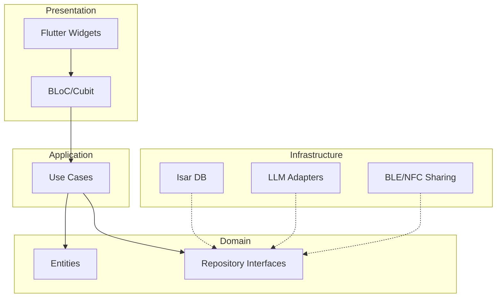
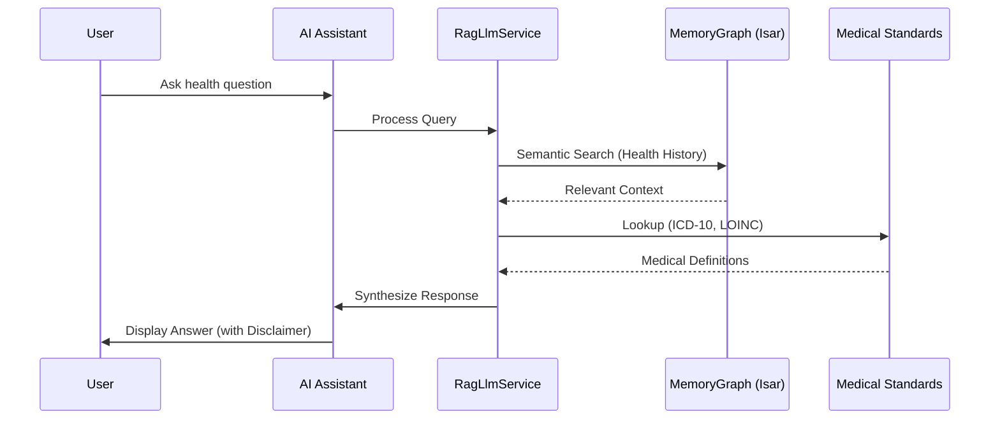

# OrionHealth Architecture

> **Privacy-First, Local-First Medical Intelligence Network**

OrionHealth is a decentralized medical intelligence network that empowers individuals to own and control their complete health data. It provides AI-powered health insights without compromising user privacy.

## 🏗️ Core Architecture Patterns

### Hexagonal Architecture (Ports & Adapters)

The project is structured to decouple business logic from infrastructure and UI.

### Feature Module Structure

Each feature in `lib/features/` follows this organization:
- **domain/**: Entities and repository definitions. Zero external dependencies.
- **application/**: Business logic and BLoC/Cubit implementations.
- **infrastructure/**: Implementation of repositories (database, network, native plugins).
- **presentation/**: UI components and pages.

---

## 🤖 AI & RAG Pipeline

OrionHealth uses on-device Retrieval-Augmented Generation (RAG) to provide contextual health insights.

### Data Flow

### Confidence-Based Response System
- **≥ 90%**: Explains possibilities with medical disclaimer.
- **< 90%**: Suggests more data or specific tests; NEVER provides a definitive interpretation.

---

## 📊 Medical Standards Architecture

We maintain a three-layer data system for medical codes:

1.  **Repo (Markdown)**: Human-readable source in `docs/medical-standards/` with Wikipedia links.
2.  **Raw Data (JSON)**: Structured data in `medical-standards/` generated via CI.
3.  **App Assets**: Bundled JSON in the APK for 100% offline access.

---

## 🚀 CI/CD Pipelines

### Android Build (`android_build.yml`)
- Triggers on push to `main` and PRs.
- Runs `flutter analyze` and `flutter test`.
- Builds a release APK.

### Documentation Deployment (`deploy-docs.yml`)
- Builds the Astro site in `docs/`.
- Deploys to GitHub Pages.

### Medical Standards CI (`medical-standards-ci.yml`)
- Parses markdown definitions and generates structured JSON files.
- Ensures medical data remains versioned and verifiable.

---

## 🛠️ Tech Stack

- **Framework**: Flutter 3.x (Material Design 3)
- **State Management**: `flutter_bloc`
- **Database**: Isar (NoSQL + Vector Search)
- **AI Inference**: Gemma/Phi-3 via ONNX Runtime & llama.cpp (Native bridge)
- **Encryption**: AES-256-GCM, PBKDF2
- **Connectivity**: Bluetooth Low Energy (BLE) for secure P2P sharing

---

*Last updated: 2026-05-08*
