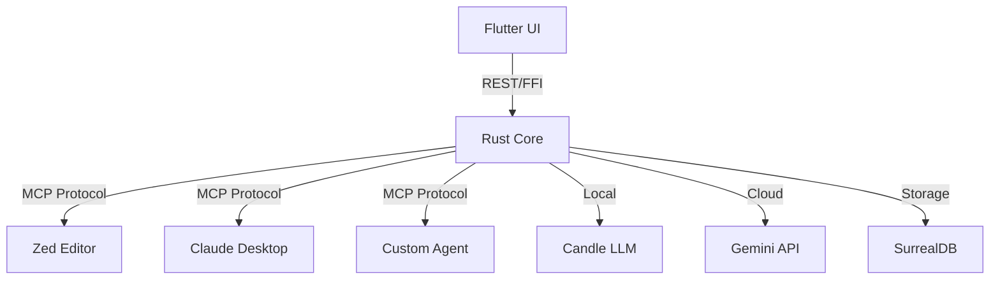

# 🚀 OrionHealth - Roadmap MCP Integration

Basado en el análisis de Neural-Link Platform, identificamos mejoras aplicables a OrionHealth manteniendo el enfoque en salud personal y privacidad.

---

## Fase 1: MCP Server Core (2-3 semanas)

### Issue #1: [MCP] Implementar Servidor MCP en Rust
**User Story:** Como desarrollador de agentes IA, quiero que OrionHealth exponga sus capacidades médicas vía MCP para integrarlas en editores/herramientas.

**Technical Tasks:**
- [ ] Agregar dependencia `mcp-server = "0.1"` a Cargo.toml
- [ ] Crear `rust/src/mcp/server.rs` con JSON-RPC 2.0
- [ ] Configurar transporte SSE (Server-Sent Events)
- [ ] Exponer tools:
  - [ ] `search_medical_records(query, date_range)`
  - [ ] `generate_health_summary(start_date, end_date, type)`
  - [ ] `add_medical_record(content, type, metadata)`
  - [ ] `get_vital_trends(vital_type, period)`
- [ ] Configurar autenticación local (token de sesión)
- [ ] Tests de integración con cliente MCP de ejemplo

**Definition of Done:**
- Zed Editor puede conectarse a OrionHealth como servidor MCP
- Los tools responden correctamente a requests JSON-RPC
- Logs estructurados para debugging

**Prioridad:** 🔴 ALTA (Habilita toda la arquitectura de agentes)

---

### Issue #2: [MCP] Cliente Flutter para Configuración MCP
**User Story:** Como usuario de OrionHealth, quiero habilitar/deshabilitar la exposición MCP desde la app.

**Technical Tasks:**
- [ ] Pantalla de configuración con toggle "Habilitar Servidor MCP"
- [ ] Mostrar URL de conexión (ej: `mcp://localhost:8765`)
- [ ] Botón "Copiar token de autorización"
- [ ] Indicador de estado (conectado/desconectado)
- [ ] Documentación in-app de cómo conectar desde Zed

**Definition of Done:**
- Usuario puede activar MCP en < 3 taps
- Token se regenera automáticamente cada 7 días
- Funciona en Android/iOS

**Prioridad:** 🟡 MEDIA

---

## Fase 2: Model Manager Local/Cloud (3-4 semanas)

### Issue #3: [LLM] Sistema de Gestión de Modelos Locales
**User Story:** Como usuario offline, quiero que OrionHealth descargue y use modelos LLM locales para generar resúmenes sin conexión.

**Technical Tasks:**
- [ ] Crear `rust/src/llm/model_manager.rs`
- [ ] Integrar `hf-hub` para descargar modelos de Hugging Face
- [ ] Implementar caché de modelos en almacenamiento local
- [ ] Soporte para modelos GGUF cuantizados:
  - [ ] Phi-3-mini-4k-instruct (Q4_K_M, ~1.8GB)
  - [ ] Llama-3.2-3B-Instruct (Q4_K_M, ~2.1GB)
- [ ] Lógica de auto-switch:
  ```rust
  if network_available && cloud_credits > 0 {
      use_cloud_llm(Gemini)
  } else {
      use_local_llm(Phi3)
  }
  ```
- [ ] UI de descarga con progreso (Flutter)
- [ ] Tests de rendimiento en hardware medio (Snapdragon 7 Gen 2)

**Definition of Done:**
- Modelos se descargan en background
- Inferencia local < 2s para 512 tokens (en hardware objetivo)
- Uso de RAM < 3GB durante inferencia
- Modelo se descarga solo una vez (persistencia)

**Prioridad:** 🔴 ALTA (Privacidad médica offline)

**Referencia:** Ver [specs/legacy_logic_reference.md](../specs/legacy_logic_reference.md) para prompts médicos.

---

### Issue #4: [LLM] Integración Cloud con Gemini (Fallback)
**User Story:** Como usuario online, quiero que OrionHealth use Gemini para resúmenes más complejos cuando esté disponible.

**Technical Tasks:**
- [ ] Agregar dependencia `google-generativeai` o API REST
- [ ] Configurar API Key en settings seguros
- [ ] Implementar `CloudLlmAdapter` para Gemini 1.5 Flash
- [ ] Lógica de costo: Preferir local para operaciones simples
- [ ] Cache de respuestas cloud (reduce costos)
- [ ] UI para configurar límite de uso mensual

**Definition of Done:**
- Usuarios pueden conectar su API Key de Gemini
- OrionHealth prioriza modelo local si la consulta es simple
- Dashboard muestra uso de tokens cloud del mes

**Prioridad:** 🟡 MEDIA

---

## Fase 3: Material Design 3 + UX (2 semanas)

### Issue #5: [UI] Migración a Material You (M3)
**User Story:** Como usuario moderno, quiero que OrionHealth siga las guías de Material Design 3 para una experiencia nativa.

**Technical Tasks:**
- [ ] Actualizar `flutter` a >= 3.22 (soporte completo M3)
- [ ] Migrar tema a `useMaterial3: true`
- [ ] Implementar color scheme dinámico:
  ```dart
  ColorScheme.fromSeed(
    seedColor: Color(0xFF26A69A), // Teal médico
    dynamicSchemeVariant: DynamicSchemeVariant.tonalSpot,
  )
  ```
- [ ] Actualizar componentes:
  - [ ] NavigationRail → NavigationBar
  - [ ] Cards con elevación variable
  - [ ] FloatingActionButton con animaciones
- [ ] Glassmorphism para cards de resumen:
  ```dart
  BackdropFilter(
    filter: ImageFilter.blur(sigmaX: 10, sigmaY: 10),
    child: Container(
      decoration: BoxDecoration(
        gradient: LinearGradient(...),
        borderRadius: BorderRadius.circular(20),
      ),
    ),
  )
  ```
- [ ] Implementar `flutter_animate` para transiciones
- [ ] Modo oscuro mejorado (colores pasteles en dark mode)

**Definition of Done:**
- 100% de widgets siguen M3 guidelines
- Transiciones fluidas (60fps mínimo)
- Screenshots aprobados por diseñador

**Prioridad:** 🟢 BAJA (Estético, no funcional)

---

### Issue #6: [UI] Dashboard de Gestión de Modelos
**User Story:** Como usuario, quiero ver qué modelos locales tengo descargados y gestionarlos.

**Technical Tasks:**
- [ ] Pantalla "Modelos IA" en settings
- [ ] Lista de modelos descargados:
  - Nombre, tamaño, fecha de descarga
  - Botón "Eliminar" (libera espacio)
- [ ] Botón "Descargar nuevo modelo" con selector
- [ ] Indicador de espacio disponible en dispositivo
- [ ] Animación de "neurona pulsante" cuando modelo está en uso

**Definition of Done:**
- Usuario puede gestionar almacenamiento de modelos
- UI muestra tamaño real del modelo en disco
- Confirmación antes de eliminar modelo

**Prioridad:** 🟡 MEDIA

---

## Fase 4: Integración con Editores (2 semanas)

### Issue #7: [MCP] Configuración Oficial para Zed Editor
**User Story:** Como desarrollador médico, quiero conectar Zed a OrionHealth para analizar datos médicos en JSON.

**Technical Tasks:**
- [ ] Crear `docs/ZED_INTEGRATION.md` con instrucciones
- [ ] Generar archivo de config para Zed:
  ```json
  {
    "mcp_servers": {
      "orionhealth": {
        "command": "orionhealth-mcp-server",
        "args": ["--token", "${ORIONHEALTH_TOKEN}"]
      }
    }
  }
  ```
- [ ] Script de instalación para Windows/macOS/Linux
- [ ] Video tutorial (screencast)
- [ ] Ejemplo de uso: "Analiza este JSON de glucemia"

**Definition of Done:**
- Zed se conecta correctamente siguiendo la doc
- Ejemplo funcional en el repo
- Video publicado en README

**Prioridad:** 🟢 BAJA (Nice to have)

---

## Fase 5: Privacidad y OAuth (4 semanas) ⚠️

### Issue #8: [Auth] Evaluación de Google OAuth para Backup Cloud
**User Story:** Como usuario que quiere backup en nube, necesito autenticarme de forma segura cumpliendo HIPAA.

**⚠️ ADVERTENCIA CRÍTICA:**
- Los datos médicos requieren cumplimiento HIPAA (USA) / GDPR (EU)
- Google OAuth2 **NO garantiza HIPAA por defecto**
- Alternativas más seguras:
  1. **Biometría local** (Face ID/Touch ID) → No sale del dispositivo
  2. **Zero-Knowledge Encryption** → Encriptar antes de subir
  3. **Self-hosted backend** → Evita third-party

**Technical Tasks (Si se procede con OAuth):**
- [ ] Investigar Google Cloud Healthcare API (HIPAA compliant)
- [ ] Implementar OAuth2 PKCE flow
- [ ] Encriptación end-to-end (AES-256-GCM)
- [ ] Clave derivada de biometría (no se envía a servidor)
- [ ] Auditoría de seguridad externa
- [ ] Legal review (consentimiento del usuario)

**Definition of Done:**
- Cumple HIPAA/GDPR
- Auditoría de seguridad aprobada
- Usuario firma consentimiento informado

**Prioridad:** 🔵 BLOQUEADO (Requiere análisis legal)

---

## Elementos NO Aplicables a OrionHealth

### ❌ Gestión de Repos Git
**Razón:** OrionHealth es para salud personal, no desarrollo de software.
**Alternativa:** Si quieres análisis de código médico (ej. FHIR schemas), mejor crear un proyecto separado.

### ❌ Integración Telegram
**Razón:** Datos médicos por Telegram viola HIPAA (no es canal seguro).
**Alternativa:** Notificaciones in-app con encriptación local.

---

## Stack Tecnológico Actualizado

### Backend (Rust)
```toml
[dependencies]
# Existentes
surrealdb = { version = "2.2.0", features = ["kv-mem"] }
candle-core = "0.8.0"
candle-transformers = "0.8.0"

# Nuevos
mcp-server = "0.1.0"                    # Model Context Protocol
hf-hub = "0.3.2"                         # Ya existe, para descargar modelos
octocrab = "0.38"                        # Solo si necesitas GitHub (opcional)
```

### Frontend (Flutter)
```yaml
dependencies:
  flutter:
    sdk: flutter

  # Nuevos
  flutter_animate: ^4.5.0                # Animaciones M3
  google_sign_in: ^6.2.0                 # Solo si OAuth (con warnings)
  local_auth: ^2.2.0                     # Biometría (recomendado)
```

---

## Decisión Arquitectónica: MCP como Pilar Central



**Beneficio:** OrionHealth se convierte en un "Health Data Context Server" que cualquier agente IA puede consumir.

---

## Próximo Paso Inmediato

**Recomendación:** Empezar por **Issue #3 (Model Manager)** en lugar de #1 (MCP).

**Razón:**
1. Model Manager es funcional inmediato (genera resúmenes offline)
2. MCP requiere que primero tengas casos de uso sólidos
3. Los usuarios valoran más "funciona sin internet" que "se integra con Zed"

**Plan de 2 semanas:**
1. **Semana 1:** Implementar `ModelManager` con descarga de Phi-3-mini
2. **Semana 2:** Conectar con `CandleLlmAdapter` para inferencia local
3. **Validar:** Generar un resumen de salud con 0 conexión a internet

---

## Recursos

- **MCP Spec:** https://modelcontextprotocol.io/
- **Zed MCP Docs:** https://zed.dev/docs/extensions/context-servers
- **Phi-3 Medical Fine-tune:** https://huggingface.co/microsoft/Phi-3-mini-4k-instruct
- **Material 3 Flutter:** https://m3.material.io/develop/flutter

---

**Estado:** 📋 Propuesta
**Próxima Revisión:** Después de completar Fase 2 (Model Manager)
