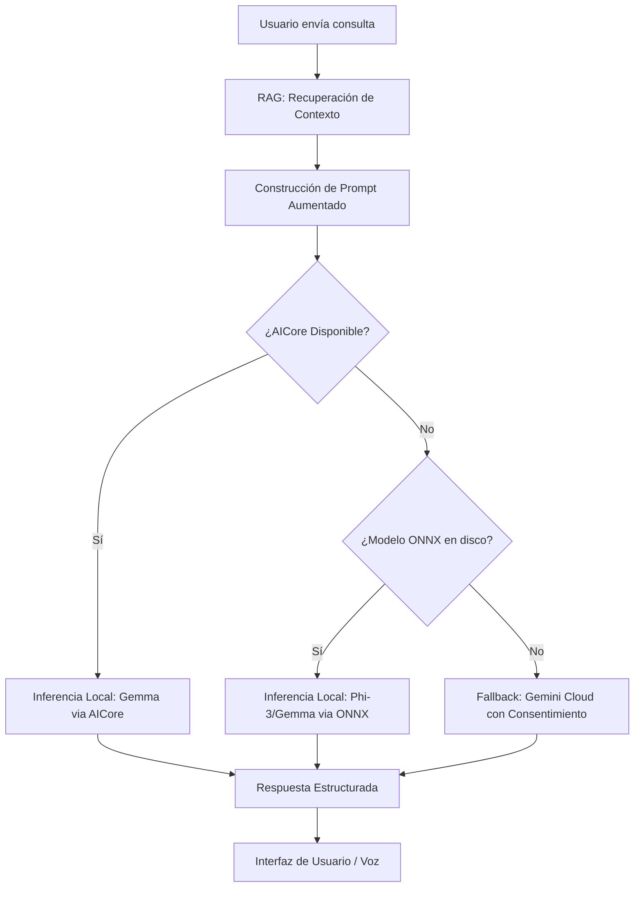

# Feature: Local AI Agent (local_agent)

## Descripción Técnica
El `local_agent` es el motor de inteligencia artificial on-device de OrionHealth. Permite que la aplicación razone sobre datos médicos, responda consultas y analice síntomas de forma 100% privada y offline.

### Pipeline On-Device

El flujo de ejecución del agente sigue cuatro etapas principales:

1.  **Descarga y Gestión (Download):**
    - Los modelos (Gemma 2B / Phi-3 Mini) se descargan desde fuentes seguras (Hugging Face / AICore) en formato cuantizado (GGUF o nativo de AICore).
    - `ModelDownloadService` gestiona la integridad y el almacenamiento en el directorio de documentos de la aplicación.
2.  **Carga (Loading):**
    - El modelo se carga en memoria utilizando ONNX Runtime o el motor AICore de Android.
    - Se realiza un "warmup" inicial para asegurar que la primera respuesta sea fluida.
3.  **Inferencia (Inference):**
    - Se utiliza un `LlmAdapter` para abstraer la implementación específica (Gemma, Phi, o fallback).
    - El sistema utiliza RAG (Retrieval-Augmented Generation) para inyectar contexto médico relevante de los estándares locales (ICD-10, LOINC) y el historial del usuario.
4.  **Respuesta (Response):**
    - La respuesta se genera por tokens y se muestra en la interfaz de chat en tiempo real.
    - Se aplica un sistema de umbrales de confianza (Confidence System) para asegurar que la información sea prudente.

### Esquema de Inferencia Local

### Privacidad y Seguridad

- **100% Local:** Por defecto, ningún dato sale del dispositivo.
- **Sin Telemetría:** No se envían logs de uso ni contenidos de chats a servidores externos.
- **Aislamiento:** El proceso de inferencia ocurre en un entorno controlado por el sistema operativo, limitando el acceso a otros recursos.

### Integraciones

- **voice_chat:** El `local_agent` actúa como el cerebro detrás del chat de voz. El texto reconocido por el ASR se envía al agente, y su respuesta se sintetiza mediante TTS.
- **medical_assistant:** Proporciona las capacidades de razonamiento para interpretar resultados de laboratorio, calcular riesgos de salud y sugerir especialidades médicas.

### Limitaciones Conocidas y Soluciones

| Limitación | Impacto | Solución / Workaround |
| :--- | :--- | :--- |
| **Consumo de RAM** | Dispositivos con < 4GB pueden cerrar la app. | Uso de modelos altamente cuantizados (4-bit) y liberación de memoria tras cada sesión. |
| **Velocidad de Inferencia** | Respuesta lenta en procesadores antiguos. | Streaming de tokens para percepción de inmediatez y uso de aceleración por hardware (NPU/GPU). |
| **Precisión Médica** | Riesgo de alucinaciones en temas complejos. | RAG estricto basado solo en estándares médicos oficiales e inclusión obligatoria de disclaimers. |
| **Tamaño en Disco** | Los modelos ocupan > 1GB. | Descarga on-demand basada en el perfil del usuario (Selective Sync). |
