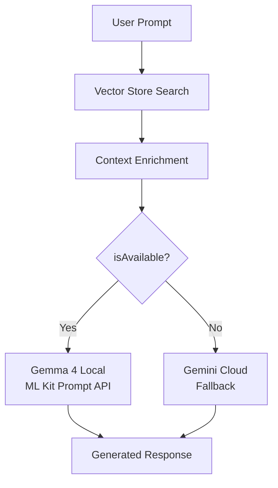

# Gemma 4 On-Device Integration Guide

> **OrionHealth** — Migración de Gemini cloud a Gemma 4 local (on-device)
> Basado en: ML Kit GenAI Prompt API v0.2.0 + Google AICore
> Actualizado: 2026-05-03

---

## 📊 Modelos

| Modelo | Params Efectivos | Params Totales | Cuantizado 4-bit | RAM Mínima | VRAM Mínima | Uso |
|--------|-----------------|----------------|-----------------|------------|-------------|-----|
| **Gemma 4 E2B** | 2.3B | 5.1B | ~1.2 GB | 4 GB | 2 GB | Rápido, tareas cotidianas (summarization, quick Q&A) |
| **Gemma 4 E4B** | 4.5B | 8.0B | ~2.4 GB | 8 GB | 4 GB | Precisión, análisis profundo (RAG reasoning, clinical analysis) |

**Características comunes:**
- Apache 2.0 License (comercialmente permisiva)
- Contexto: 128K tokens
- Vocabulario: 262K tokens
- Soporte multimodal: Texto, Imagen, Audio
- Sliding window: 512 tokens
- Arquitectura: Dense con Per-Layer Embeddings (PLE)
- Thinking mode configurable
- Function calling nativo

**Benchmark comparativo:**
- E2B: ~3x más rápido que E4B → ideal para UI responses en tiempo real
- E4B: mejor precisión en razonamiento clínico → ideal para análisis RAG profundo
- Ambos: hasta 4x más rápidos y 60% menos batería que Gemma 3

---

## 📥 Descarga de Modelos

### Desde Hugging Face (recomendado)

```bash
# Modelo E2B (2B params)
# url: https://huggingface.co/google/gemma-4-E2B
# Formatos disponibles: FP16, GGUF, SafeTensors
git lfs install
git clone https://huggingface.co/google/gemma-4-E2B

# Modelo E4B (4B params)
# url: https://huggingface.co/google/gemma-4-E4B
git clone https://huggingface.co/google/gemma-4-E4B
```

### Usando Hugging Face CLI (recomendado para CI/CD)

```bash
pip install huggingface-hub[cli]

# Descargar E2B (solo pesos del modelo, sin history git)
huggingface-cli download google/gemma-4-E2B --local-dir ./models/gemma-4-E2B

# Descargar E4B
huggingface-cli download google/gemma-4-E4B --local-dir ./models/gemma-4-E4B
```

### Formatos disponibles por variante

| Variante HF | Formato | Tamaño aprox | Notas |
|-------------|---------|-------------|-------|
| `google/gemma-4-E2B` | FP16 (SafeTensors) | ~10 GB | Pesos completos |
| `google/gemma-4-E4B` | FP16 (SafeTensors) | ~16 GB | Pesos completos |
| Unsloth/lm-kit GGUF | GGUF Q4_K_M | ~1.2 GB (E2B), ~2.4 GB (E4B) | **Recomendado para mobile** |
| Kaggle | SafeTensors | Same as HF | Acceso via API Kaggle |

### Desde Kaggle

```bash
# Opcional: si prefieres Kaggle
kaggle models download google/gemma-4/E2B
kaggle models download google/gemma-4/E4B
```

> ⚠️ **Importante:** Para Android on-device NO necesitas descargar modelos manualmente.
> AICore los descarga automáticamente via Developer Preview (ver sección Android).

---

## 📱 Integración Android (AICore + ML Kit GenAI)

### Prerrequisitos de hardware

Dispositivos soportados (AICore Developer Preview, abril 2026):

**Prompt API (nano-v2 / nano-v3):**
- Google Pixel 7+ (incluyendo Pixel 9, Pixel 10 series)
- Samsung Galaxy S25, S26 y series selectas
- OnePlus 13, 15 series
- Xiaomi 14T Pro, 15, 17 series
- OPPO Find X8/X9 series, Reno 14/15 series
- Honor Magic 7/8 series
- Lista completa: https://developers.google.com/ml-kit/genai/prompt/android/get-started

### Device Setup

1. **Unirte al grupo** [aicore-experimental](https://groups.google.com/g/aicore-experimental) con la cuenta Google de tu dispositivo de prueba.
2. **Optar al beta** de AICore en Play Store: https://play.google.com/apps/testing/com.google.android.aicore
3. Esperar hasta 1 hora para que la app AICore aparezca.
4. Abrir AICore, aceptar términos, descargar modelo Gemma 4 deseado (E2B o E4B).
5. La primera inferencia puede tardar ~1 minuto (carga del modelo a memoria). Las siguientes son rápidas.

### Gradle Setup

```kotlin
// android/app/build.gradle.kts
android {
    minSdk = 24 // o superior
}

dependencies {
    // ML Kit GenAI Prompt API
    implementation("com.google.mlkit:genai:0.2.0")
}
```

### AndroidManifest.xml

```xml
<manifest>
    <!-- Necesario solo para descarga inicial del modelo -->
    <uses-permission android:name="android.permission.INTERNET" />
    <!-- Opcional, mejora velocidad de descarga -->
    <uses-permission android:name="android.permission.ACCESS_NETWORK_STATE" />
</manifest>
```

---

## 🔌 Integración Flutter (Method Channel)

Dado que ML Kit GenAI Prompt API es nativo de Android (Java/Kotlin), no existe un paquete Dart oficial en pub.dev (abril 2026). La integración se hace mediante **Method Channel** entre Flutter/Dart y el código nativo Android.

### 1. Crear el Method Channel en Dart

```dart
// lib/services/gemma4_service.dart
import 'package:flutter/services.dart';

class Gemma4Service {
  static const _channel = MethodChannel('com.orionhealth/gemma4');

  /// Verifica si el on-device AI está disponible en este dispositivo
  static Future<bool> isAvailable() async {
    try {
      return await _channel.invokeMethod('isAvailable');
    } catch (e) {
      return false;
    }
  }

  /// Genera texto usando Gemma 4 local
  static Future<String> generate(String prompt, {String model = 'gemma-4-e2b'}) async {
    try {
      return await _channel.invokeMethod('generate', {
        'prompt': prompt,
        'model': model,
      });
    } catch (e) {
      throw Exception('Gemma 4 local inference failed: $e');
    }
  }

  /// Genera texto con streaming (para respuestas en vivo)
  static Stream<String> generateStream(String prompt, {String model = 'gemma-4-e2b'}) async* {
    final eventChannel = EventChannel('com.orionhealth/gemma4_stream');
    await for (final chunk in eventChannel.receiveBroadcastStream({
      'prompt': prompt,
      'model': model,
    })) {
      yield chunk as String;
    }
  }
}
```

### 2. Implementación nativa en Android (Kotlin)

```kotlin
// android/app/src/main/kotlin/com/orionhealth/Gemma4Plugin.kt
package com.orionhealth

import android.content.Context
import androidx.annotation.NonNull
import com.google.mlkit.genai.prompt.Prompt
import com.google.mlkit.genai.prompt.PromptRequest
import com.google.mlkit.genai.prompt.PromptResponse
import com.google.mlkit.genai.common.FeatureStatus
import io.flutter.embedding.engine.plugins.FlutterPlugin
import io.flutter.plugin.common.MethodCall
import io.flutter.plugin.common.MethodChannel
import io.flutter.plugin.common.EventChannel
import kotlinx.coroutines.*

class Gemma4Plugin : FlutterPlugin, MethodChannel.MethodCallHandler {
    private lateinit var channel: MethodChannel
    private lateinit var eventChannel: EventChannel
    private lateinit var context: Context
    private val scope = CoroutineScope(Dispatchers.IO + SupervisorJob())
    
    override fun onAttachedToEngine(@NonNull flutterPluginBinding: FlutterPlugin.FlutterPluginBinding) {
        context = flutterPluginBinding.applicationContext
        channel = MethodChannel(flutterPluginBinding.binaryMessenger, "com.orionhealth/gemma4")
        channel.setMethodCallHandler(this)
        
        eventChannel = EventChannel(flutterPluginBinding.binaryMessenger, "com.orionhealth/gemma4_stream")
    }

    override fun onMethodCall(@NonNull call: MethodCall, @NonNull result: MethodChannel.Result) {
        when (call.method) {
            "isAvailable" -> checkAvailability(result)
            "generate" -> {
                val prompt = call.argument<String>("prompt") ?: ""
                val model = call.argument<String>("model") ?: "gemma-4-e2b"
                generateContent(prompt, model, result)
            }
            else -> result.notImplemented()
        }
    }

    private fun checkAvailability(result: MethodChannel.Result) {
        scope.launch {
            try {
                val status = Prompt.getClient().checkFeatureStatus(
                    PromptRequest.builder()
                        .setModelName("gemma-4-e2b")
                        .build()
                ).await()
                result.success(status == FeatureStatus.AVAILABLE)
            } catch (e: Exception) {
                result.success(false)
            }
        }
    }

    private fun generateContent(prompt: String, model: String, result: MethodChannel.Result) {
        scope.launch {
            try {
                val request = PromptRequest.builder()
                    .setModelName(model)
                    .setInputText(prompt)
                    .build()
                val response = Prompt.getClient().generateContent(request).await()
                val text = response.candidates
                    .firstOrNull()
                    ?.content
                    ?.parts
                    ?.firstOrNull()
                    ?.text
                    .orEmpty()
                result.success(text)
            } catch (e: Exception) {
                result.error("GEMMA_ERROR", e.message, null)
            }
        }
    }

    override fun onDetachedFromEngine(@NonNull binding: FlutterPlugin.FlutterPluginBinding) {
        channel.setMethodCallHandler(null)
        eventChannel.setStreamHandler(null)
        scope.cancel()
    }
}
```

### 3. Registrar el plugin en Flutter

```kotlin
// android/app/src/main/kotlin/com/orionhealth/MainActivity.kt
package com.orionhealth

import io.flutter.embedding.android.FlutterActivity
import io.flutter.embedding.engine.FlutterEngine
import io.flutter.plugins.GeneratedPluginRegistrant

class MainActivity : FlutterActivity() {
    override fun configureFlutterEngine(@NonNull flutterEngine: FlutterEngine) {
        GeneratedPluginRegistrant.registerWith(flutterEngine)
    }
}
```

### 4. Agregar dependencias Gradle

```kotlin
// android/app/build.gradle.kts
dependencies {
    implementation("com.google.mlkit:genai:0.2.0")
    implementation("org.jetbrains.kotlinx:kotlinx-coroutines-android:1.8.1")
}
```

---

## 🔄 Modificación del Adapter (GemmaLlmAdapter)

### Estrategia de Integración

El `GemmaLlmAdapter` actual (en `lib/features/local_agent/infrastructure/adapters/gemma_llm_adapter.dart`) usa exclusivamente Gemini cloud. La migración a Gemma 4 local debe seguir esta arquitectura:

```
┌─────────────────────────────────────────────────────────────┐
│  GemmaLlmAdapter (refactorizado)                           │
│                                                             │
│  generate(prompt):                                          │
│    1. Intentar: Gemma 4 local (ML Kit GenAI Prompt API)     │
│    2. Fallback: Gemini cloud (google_generative_ai)          │
│                                                             │
│  isAvailable():                                             │
│    → true si AICore está disponible O hay API key           │
│                                                             │
│  modelName:                                                 │
│    → "gemma-4-e2b-local" o "gemini-2.0-flash-cloud"        │
└─────────────────────────────────────────────────────────────┘
```

### Código del adapter modificado

```dart
import 'dart:io';
import 'package:flutter/services.dart';
import 'package:google_generative_ai/google_generative_ai.dart';
import 'package:injectable/injectable.dart';
import '../../domain/services/llm_adapter.dart';

/// Gemma 4 adapter with hybrid local/cloud strategy.
///
/// Priority:
/// 1. Gemma 4 local via ML Kit GenAI Prompt API (AICore)
/// 2. Fallback: Gemini cloud via google_generative_ai
///
/// This adapter automatically detects if AICore is available
/// on the device and routes to local inference when possible.
@LazySingleton(as: LlmAdapter)
@Named('gemma')
class GemmaLlmAdapter implements LlmAdapter {
  static const _channel = MethodChannel('com.orionhealth/gemma4');
  GenerativeModel? _geminiModel;

  String get _apiKey => Platform.environment['GEMINI_API_KEY'] ?? '';

  @override
  String get modelName => 'gemma-4-e2b-local';

  @override
  Future<bool> isAvailable() async {
    // Check if local Gemma 4 is available (AICore + model downloaded)
    try {
      final localAvailable = await _channel.invokeMethod<bool>('isAvailable');
      if (localAvailable == true) return true;
    } catch (_) {
      // MethodChannel not registered yet, or device doesn't support AICore
    }

    // Fallback: check if Gemini cloud API key is available
    return _apiKey.isNotEmpty;
  }

  @override
  Future<String> generate(String prompt) async {
    // Attempt 1: Local Gemma 4 via ML Kit
    final localResult = await _tryLocalGeneration(prompt);
    if (localResult != null) return localResult;

    // Attempt 2: Fallback to Gemini cloud
    return _generateViaCloud(prompt);
  }

  /// Try to generate using on-device Gemma 4 via AICore/ML Kit
  Future<String?> _tryLocalGeneration(String prompt) async {
    try {
      final result = await _channel.invokeMethod<String>('generate', {
        'prompt': prompt,
        'model': 'gemma-4-e2b',
      });
      if (result != null && result.isNotEmpty) return result;
    } catch (e) {
      // Local inference failed — probably no AICore support
      // Fall through to cloud
    }
    return null;
  }

  /// Fallback: generate using Gemini cloud API
  Future<String> _generateViaCloud(String prompt) async {
    if (_geminiModel == null) {
      if (_apiKey.isEmpty) {
        throw Exception(
          'GEMINI_API_KEY not configured and local Gemma 4 unavailable. '
          'Set environment variable or run on a supported device.',
        );
      }
      _geminiModel = GenerativeModel(
        model: 'gemini-2.0-flash',
        apiKey: _apiKey,
      );
    }

    try {
      final response = await _geminiModel!.generateContent([
        Content.text(prompt),
      ]);
      return response.text ?? '';
    } catch (e) {
      throw Exception('Gemma 4 generation failed (local + cloud): $e');
    }
  }
}
```

### Estrategia de selección de modelo

| Situación | Modelo usado | Latencia |
|-----------|-------------|----------|
| AICore + Gemma E2B descargado | Gemma 4 E2B local | ~100-500ms |
| AICore + Gemma E4B descargado | Gemma 4 E4B local | ~300-1500ms |
| AICore no disponible | Gemini 2.0 Flash cloud | ~1-3s |
| Sin API key + sin AICore | ❌ Error controlado | N/A |

---

## 🧠 RAG Pipeline con Gemma 4 Local

El pipeline RAG existente en `RagLlmService` puede extenderse para usar Gemma 4 local:



Los embeddings locales pueden continuar usándose con el vector store Isar existente. Gemma 4 se encarga de la generación de texto, no de embeddings.

---

## 📦 Pubspec.yaml — Dependencias Necesarias

```yaml
dependencies:
  flutter:
    sdk: flutter
  # ... existing dependencies ...

  # Gemini cloud (ya existente — se mantiene como fallback)
  google_generative_ai: ^0.4.7

  # Para Method Channel (ya viene con Flutter SDK)
  # No se necesita dependencia adicional en pubspec.yaml
  # La implementación nativa está en android/app/
```

> **Nota:** No existe un paquete `google_ai_edge_gemma` en pub.dev (abril 2026). La integración se hace vía Method Channel con código nativo Kotlin.

---

## 🔧 Troubleshooting

### "First inference takes ~1 minute"
Es normal. AICore carga el modelo a memoria en la primera invocación. Las siguientes son rápidas (100-500ms).

### "checkFeatureStatus returns UNAVAILABLE"
- El modelo no está descargado aún → abrir app AICore y descargar
- Dispositivo no soportado → verificar lista de dispositivos compatibles
- Beta de AICore no activada → unirse al grupo aicore-experimental

### "MethodChannel not implemented"
El plugin nativo Gemma4Plugin no está registrado. Agregar en `MainActivity.configureFlutterEngine()`.

### "Gemma 4 generate returns empty string"
- El prompt puede estar fuera del contexto de 128K tokens
- El modelo no soporta el formato de prompt usado → verificar system prompt

---

## 📚 Referencias

- [Gemma 4 Launch Blog](https://blog.google/innovation-and-ai/technology/developers-tools/gemma-4/)
- [Hugging Face - Gemma 4 E2B](https://huggingface.co/google/gemma-4-E2B)
- [Hugging Face - Gemma 4 E4B](https://huggingface.co/google/gemma-4-E4B)
- [ML Kit GenAI Prompt API (Android)](https://developers.google.com/ml-kit/genai/prompt/android/get-started)
- [ML Kit GenAI Overview](https://developers.google.com/ml-kit/genai)
- [AICore Developer Preview](https://developers.google.com/ml-kit/genai/aicore-dev-preview)
- [Gemma 4 Documentation - Mobile](https://ai.google.dev/gemma/docs/integrations/mobile)
- [Medium: Building on-device AI with Gemma 4 + ML Kit](https://medium.com/google-cloud/building-your-first-on-device-ai-feature-with-gemma-4-and-the-ml-kit-prompt-api-1fe94039ab4d)
- [Apache 2.0 License](https://ai.google.dev/gemma/docs/gemma_4_license)
