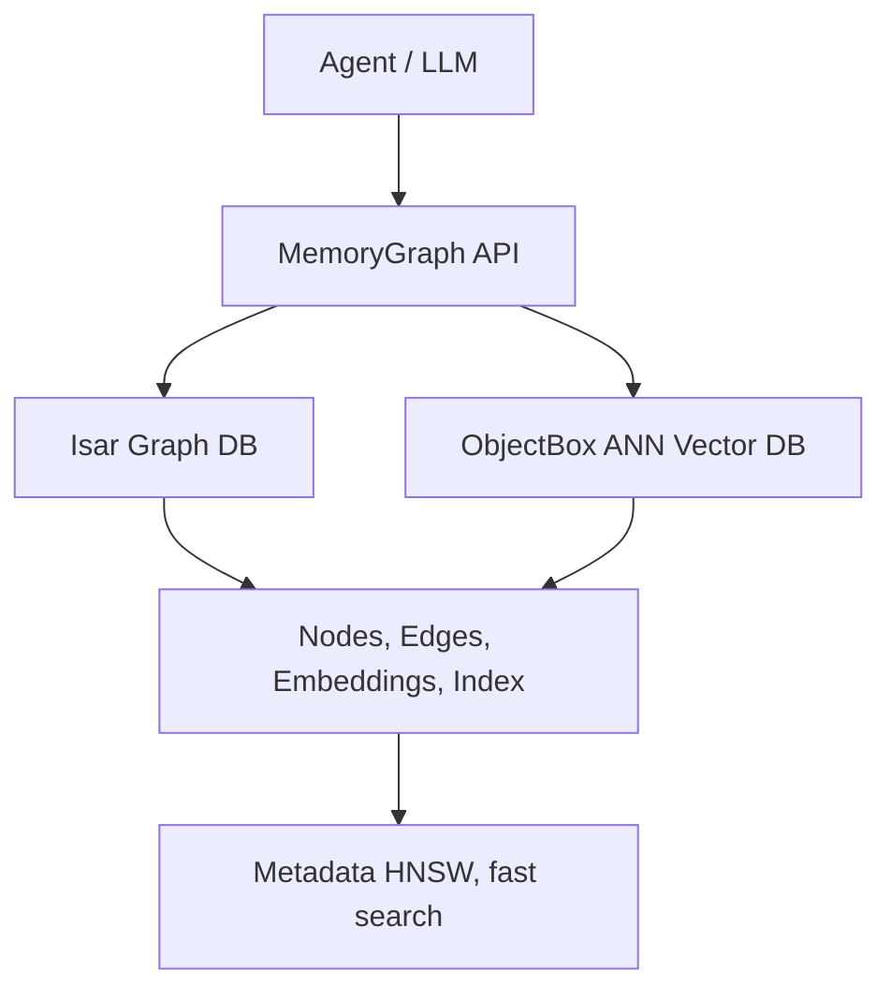

# 🧠 isar_agent_memory

[](https://pub.dev/packages/isar_agent_memory)
[](https://github.com/iberi22/isar_agent_memory/actions)
[](https://isar.dev)
[](https://pub.dev/packages/langchain)

> 🚧 **BETA**: This package is in active development. API may change. Feedback and PRs are welcome!

---

## 🚀 Quickstart

### 1. Add dependency (pubspec.yaml)

```yaml
isar_agent_memory: ^0.3.0
isar: ^3.1.0+1
# ObjectBox is the default vector backend.
# onnxruntime is used for on-device embeddings.
# cryptography is used for sync encryption.
```

### 2. Basic Usage

```dart
import 'package:isar/isar.dart';
import 'package:isar_agent_memory/isar_agent_memory.dart';
import 'package:isar_agent_memory/src/gemini_embeddings_adapter.dart';

// 1. Initialize the embeddings adapter (e.g., Gemini)
final adapter = GeminiEmbeddingsAdapter(apiKey: '<YOUR_GEMINI_API_KEY>');

// 2. Open Isar database with schemas
final isar = await Isar.open([
  MemoryNodeSchema, MemoryEdgeSchema
], directory: './exampledb');

// 3. Initialize MemoryGraph
final graph = MemoryGraph(isar, embeddingsAdapter: adapter);

// 4. Store a node with embedding (automatically indexed)
final nodeId = await graph.storeNodeWithEmbedding(content: 'The quick brown fox jumps over the lazy dog.');

// 5. Semantic search (ANN)
final queryEmbedding = await adapter.embed('A fox jumps over a dog');
final results = await graph.semanticSearch(queryEmbedding, topK: 3);

for (final result in results) {
  print('Node: ${result.node.content}');
  print('Distance: ${result.distance.toStringAsFixed(3)}');
  print('Provider: ${result.provider}');
}

// 6. Explain recall
if (results.isNotEmpty) {
  final explanation = await graph.explainRecall(results.first.node.id, queryEmbedding: queryEmbedding);
  print('Explain: $explanation');
}
```

---

## 🔄 Sync & Privacy (Beta)

This package supports an encrypted, offline-first synchronization protocol (LWW - Last Write Wins).

### Export Encrypted Data

```dart
import 'package:isar_agent_memory/isar_agent_memory.dart';
import 'package:isar_agent_memory/src/sync/sync_manager.dart';

final syncManager = SyncManager(graph);
// Initialize with a 32-byte key (or generate one)
final key = List<int>.generate(32, (i) => i);
await syncManager.initialize(encryptionKey: key);

// Export encrypted snapshot
final encryptedData = await syncManager.exportEncryptedSnapshot();
// Upload 'encryptedData' to your cloud storage or peer.
```

### Import Encrypted Data

```dart
// Download 'encryptedData' from cloud...
await syncManager.importEncryptedSnapshot(encryptedData);
// Local DB is now merged with remote data.
```

**Note:** Data is encrypted using AES-256-GCM (via `cryptography` package). The server only sees encrypted blobs.

---

## 🧠 HiRAG (Hierarchical RAG) Support

**HiRAG** (Hierarchical Retrieval-Augmented Generation) enables multi-level knowledge organization. The foundation is complete with layer-based node organization and summary relationships.

### Features

- **Layer-based Organization**: Organize nodes in hierarchical layers (0 = base facts, 1+ = summaries/abstractions)
- **Summary Nodes**: Create aggregated summaries of multiple child nodes
- **Relationship Types**: Built-in `summary_of` and `part_of` relation types
- **Layer Queries**: Efficiently retrieve all nodes at a specific layer

### Usage Example

```dart
import 'package:isar_agent_memory/isar_agent_memory.dart';

// Store base-layer facts (layer 0 is default)
final fact1Id = await graph.storeNodeWithEmbedding(
  content: 'The user prefers dark mode in the evening.',
);
final fact2Id = await graph.storeNodeWithEmbedding(
  content: 'The user typically works from 9 AM to 5 PM.',
);

// Create a summary node at layer 1
final summaryId = await graph.createSummaryNode(
  summaryContent: 'User has established work schedule and UI preferences.',
  childNodeIds: [fact1Id, fact2Id],
  layer: 1,
  type: 'user_profile_summary',
);

// Retrieve all summaries at layer 1
final summaries = await graph.getNodesByLayer(1);
for (final summary in summaries) {
  print('Layer 1 Summary: ${summary.content}');
}

// Retrieve base facts at layer 0
final baseFacts = await graph.getNodesByLayer(0);
print('Total base facts: ${baseFacts.length}');
```

### Architecture

HiRAG implementation includes:
- `HierarchicalMemoryGraph` extension on `MemoryGraph`
- `layer` field on `MemoryNode` for hierarchical positioning
- Automatic edge creation between child nodes and summaries
- Support for multi-level abstraction hierarchies

### Future Enhancements

Planned improvements:
- Automatic summarization using LLMs
- Multi-hop retrieval (search across layers)
- Layer-aware semantic search with configurable depth

---

## 🔒 On-Device Embeddings (Local Privacy)

You can run embeddings entirely on-device using ONNX Runtime (e.g., with `all-MiniLM-L6-v2`).

### 1. Download Model and Vocab

- Download the ONNX model (e.g., `model.onnx` or `model_quantized.onnx`) from Hugging Face or similar.
- Download the `vocab.txt` used by the model (WordPiece vocabulary).

### 2. Usage

```dart
import 'package:isar_agent_memory/isar_agent_memory.dart';

final adapter = OnDeviceEmbeddingsAdapter(
  modelPath: 'assets/model.onnx',
  vocabPath: 'assets/vocab.txt',
  dimension: 384, // Default for MiniLM-L6-v2
);

// Initialize (loads model and vocab)
await adapter.initialize();

final graph = MemoryGraph(isar, embeddingsAdapter: adapter);
```

> **Note**: For mobile apps (Flutter), ensure you add the `.onnx` and `.txt` files to your `pubspec.yaml` assets.

---

## 🧪 Testing

### Running Unit Tests

```bash
dart test
```

### Running On-Device Adapter Tests

To run tests that require the ONNX model files, you must first download the test resources:

1. **Download Test Resources**:
   ```bash
   dart run tool/setup_on_device_test.dart
   ```
   This will download `model.onnx` and `vocab.txt` to the `test_resources/` directory.

2. **Run the Tests**:
   ```bash
   dart test test/on_device_embeddings_adapter_test.dart
   ```

---

## 🧬 Features

- **Universal Graph API**: Store, recall, relate, search, and explain memories.
- **Fast ANN Search**: Uses **ObjectBox (HNSW)** as the default vector backend.
- **Pluggable Vector Index**: Swap ObjectBox for a custom backend if needed.
- **Pluggable Embeddings**: Adapters for Gemini, OpenAI, or **On-Device (ONNX)**.
- **Explainability**: Semantic distance, activation (recency/frequency), and path tracing.
- **Hybrid Search**: Combine vector similarity with full-text search (BM25-like) for better recall.
- **Robust Testing**: comprehensive test suite and real-world examples.
- **Extensible**: Add metadata, new adapters, or future sync/export capabilities.
- **Sync & Privacy**: Client-side AES-GCM encryption, LWW conflict resolution.

---

## 🛠️ Integrations

- [Isar](https://isar.dev): Local, fast NoSQL DB for Dart/Flutter.
- [ObjectBox](https://objectbox.io): On-device vector search (HNSW) with floatVector & HNSW index (default).
- [LangChain](https://pub.dev/packages/langchain): LLM/agent workflows.
- [Gemini](https://pub.dev/packages/google_generative_ai): Embeddings provider.
- [ONNX Runtime](https://onnxruntime.ai): On-device inference.

---

## 🛠️ Troubleshooting

### Isar Native Library (`isar.dll`) Loading Failure in Tests

**Problem:**
When running `flutter test` within the `isar_agent_memory_tests` subproject on Windows, tests may fail with `Invalid argument(s): Failed to load dynamic library '...\isar.dll'`.

**Solution:**
The test suite (`test/memory_graph_test.dart`) includes a workaround that automatically locates `isar_flutter_libs` and copies the correct `isar.dll` to the project root if it's missing. This ensures tests run reliably on Windows.

---

## ⚠️ Known Issues

- **Gemini Tests**: Require an API key.
  ```bash
  export GEMINI_API_KEY=<YOUR_KEY>
  dart test
  ```
- **Windows DLLs**: Handled automatically by the test runner as described above.

---

## 📦 Publishing

- This package is **BETA**.
- To publish:

```sh
dart pub publish --dry-run
```

---

## 🤝 Contributing

PRs, issues, and feedback are welcome! See [CONTRIBUTING.md](CONTRIBUTING.md).

---

## ⚖️ License

MIT

---

> **isar_agent_memory** is not affiliated with Isar, LangChain, Gemini, or OpenAI. Names/logos are for reference only.

---

### 🏷️ Tags

`isar` `langchain` `embeddings` `memory` `agents` `llm` `flutter` `dart`

---

## Overview

**isar_agent_memory** provides a robust, explainable, and extensible memory system for agents and LLMs. It combines a universal graph (nodes, edges, metadata) with efficient vector search, pluggable embeddings, and advanced explainability.

- **Universal Graph**: Store facts, messages, concepts, and relations.
- **Efficient Semantic Search**: ANN (HNSW) for context retrieval.
- **Pluggable Embeddings**: Gemini, OpenAI, or custom.
- **Explainability**: Trace why a memory was recalled.
- **LLM-Agnostic**: Use with any agent, chatbot, or LLM workflow.



- **MemoryGraph**: Main API.
- **Isar**: Stores nodes, edges, metadata.
- **ObjectBox**: Provides fast semantic search (HNSW).
- **EmbeddingsAdapter**: Interface for embedding providers.

---

## Embeddings: Pluggable Providers

- Use `GeminiEmbeddingsAdapter` or implement `EmbeddingsAdapter`.
- Example (Gemini):

```dart
final adapter = GeminiEmbeddingsAdapter(apiKey: '<YOUR_GEMINI_API_KEY>');
```

- Custom Provider (e.g., OpenAI):

```dart
class MyEmbeddingsAdapter implements EmbeddingsAdapter {
  @override
  String get providerName => 'my_provider';
  @override
  Future<List<double>> embed(String text) async {
    // Call your embedding API here
  }
}
```

### Fallback to Gemini (Cloud)

Compose adapters with `FallbackEmbeddingsAdapter` to prefer on-device/local models and fall back to cloud (Gemini) on failure.

```dart
import 'dart:io';
import 'package:isar_agent_memory/isar_agent_memory.dart';

final local = OnDeviceEmbeddingsAdapter(modelPath: '...', vocabPath: '...');
final gemini = GeminiEmbeddingsAdapter(
  apiKey: Platform.environment['GEMINI_API_KEY'] ?? '',
);

final adapter = FallbackEmbeddingsAdapter(
  primary: local,
  fallback: gemini,
  fallbackOnEmpty: true,
);

final graph = MemoryGraph(isar, embeddingsAdapter: adapter);
```

### Environment Variables

- Use a `.env` file (and `flutter_dotenv`) or system environment variables for API keys.

```bash
export GEMINI_API_KEY=xxxx
```

---

## Semantic Search (ANN)

- Uses ObjectBox (HNSW) by default.

```dart
final queryEmbedding = await adapter.embed('search phrase');
final results = await graph.semanticSearch(queryEmbedding, topK: 5);
```

### Hybrid Search

Combine vector search with full-text search (Isar filter) for better recall.

```dart
final results = await graph.hybridSearch('search phrase', topK: 5, alpha: 0.5);
```

---

## 🔌 Pluggable Vector Index Backends

- **ObjectBox (Default)**: On-device HNSW.

Usage with default ObjectBox:

```dart
final graph = MemoryGraph(isar, embeddingsAdapter: adapter);
```

Usage with Custom/External ObjectBox:

```dart
final index = ObjectBoxVectorIndex.open(
  directory: './obxdb',
  namespace: 'default',
);
final graph = MemoryGraph(isar, embeddingsAdapter: adapter, index: index);
```

**ObjectBox Notes:**
- The `ObxVectorDoc` entity uses `@HnswIndex(dimensions: 768, ...)`.
- If you use embeddings with different dimensions (e.g., OpenAI's 1536), you must modify the entity and regenerate code.

---

## Explainability

- Every recall result can be explained via:
  - **Semantic Distance**: How close to the query?
  - **Provider**: Which model generated the embedding?
  - **Activation**: Recency, frequency, importance.
  - **Path Tracing**: Why did this memory surface in the graph?

```dart
final explanation = await graph.explainRecall(nodeId, queryEmbedding: queryEmbedding);
print(explanation);
```

---

## Extensibility

- Add new embedding providers.
- Store arbitrary metadata.
- Sync/export planned.

---

## Roadmap

- [x] Pluggable `VectorIndex` + `ObjectBoxVectorIndex` default.
- [x] `GeminiEmbeddingsAdapter` + `FallbackEmbeddingsAdapter`.
- [x] `InMemoryVectorIndex` for tests.
- [x] `OnDeviceEmbeddingsAdapter` (ONNX) for Android/iOS/Desktop.
- [x] Benchmarks via GitHub Actions.
- [x] Hybrid Retrieval (Dense + Isar Filter).
- [x] Sync & Privacy (Encryption with AES-256-GCM, LWW conflict resolution).
- [x] HiRAG Phase 1 (Layer-based organization, summary nodes, relationship types).
- [ ] HiRAG Phase 2 (Automatic LLM-based summarization, multi-hop retrieval).
- [ ] Cross-device sync backend (Firebase/WebSocket integration).
- [ ] Re-ranking and advanced retrieval strategies.

---

## ⚙️ Testing

This package contains standard Dart/Flutter tests.

### Running Tests

```bash
flutter test
```

---

## 🔄 Continuous Dependency Updates

Uses **Dependabot** for automated PRs and **Coderabbit** for AI-assisted reviews. Merges to `main` require passing CI checks.
